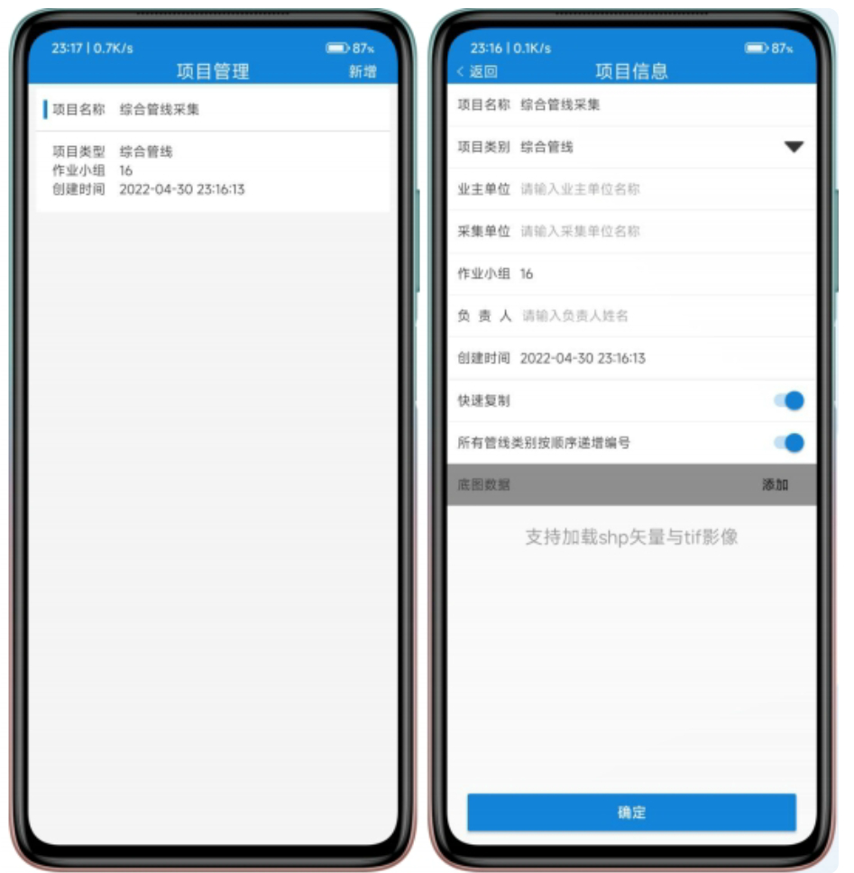
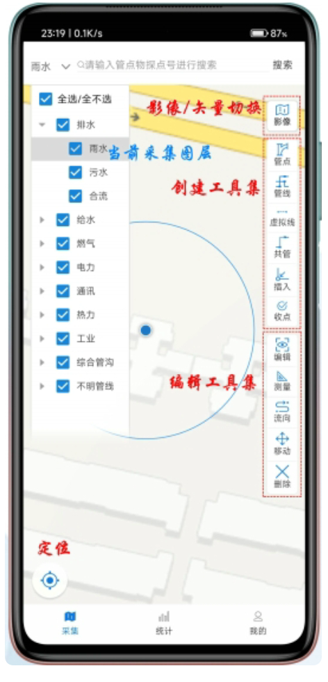
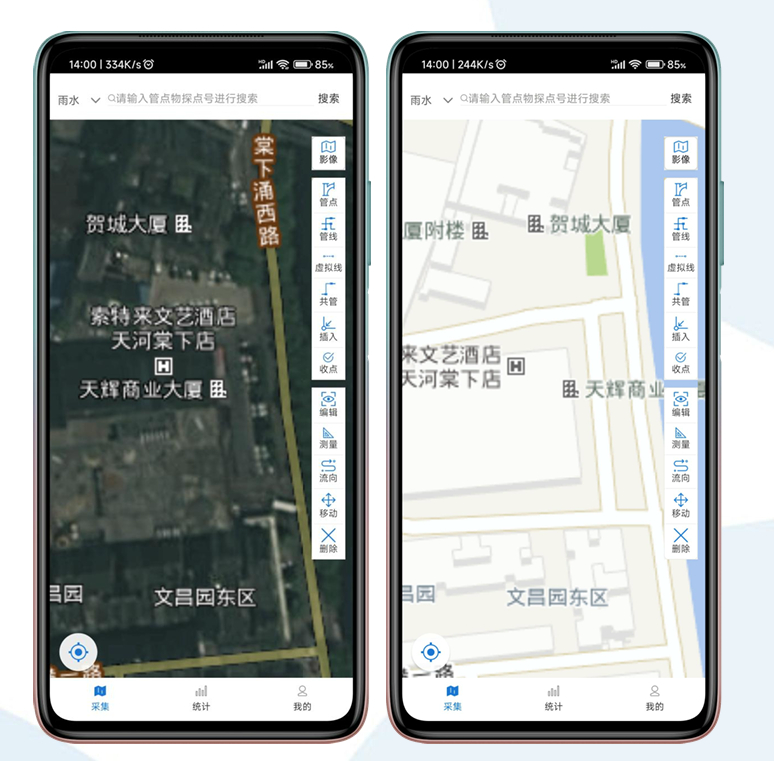
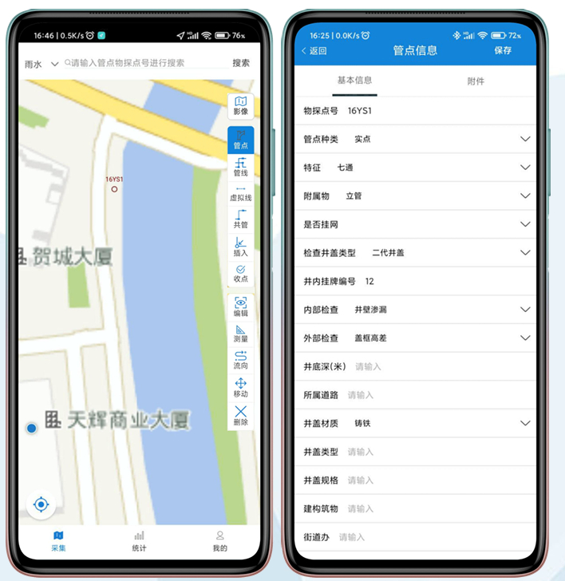
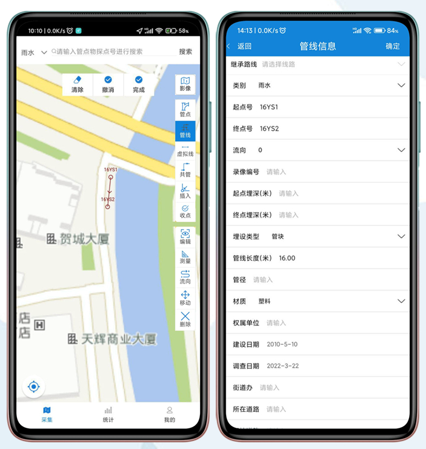
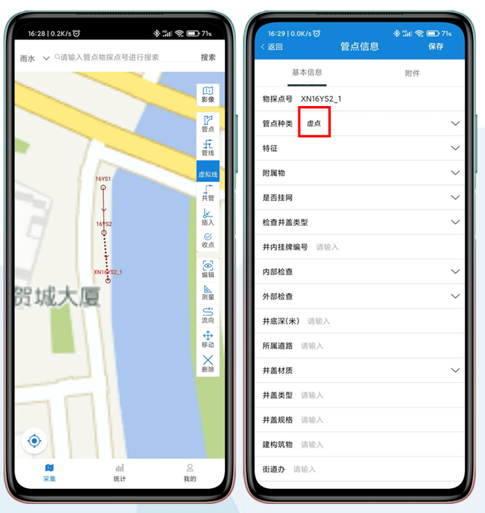
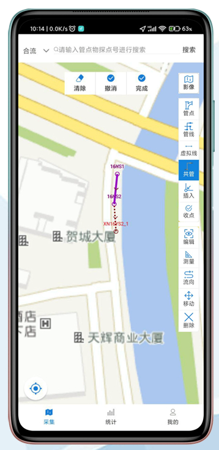
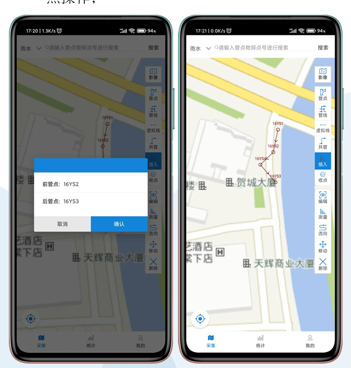
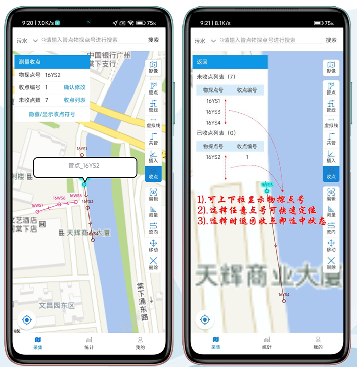
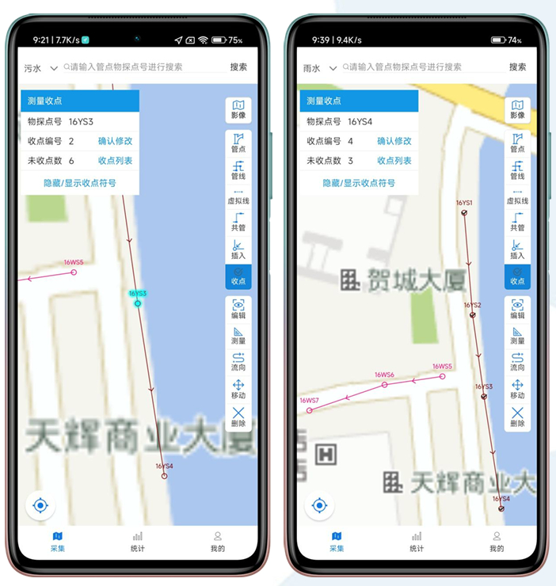

# 1. 产品概述

## 1.1 产品简介

绘管通是广东绘宇智能勘测科技有限公司开发的管网数据采集系统，专为地下管网普查、更新及补测设计。它支持外业数据采集、属性录入（如正则表达式与下拉菜单）、图文一体化管理，显著提升作业效率并减少错误率。与传统纸质记录相比，绘管通实现了外业采集与内业处理的无缝衔接。  
核心优势：  

## 1.2 快速使用指引

1. 首次使用：创建项目信息（推荐加载本地.shp矢量或.tif影像）。  
2. 启用设备：开启GPS定位。  
3. 采集操作：进入采集模块 → 点击定位图标 → 采集管点 → 连接管点生成管线。  

# 2. 核心功能模块详解

## 2.1 软件登录
• 登录方式：手机号码获取验证码登录。  
• 法律合规：首次安装需同意《用户协议》和《隐私政策》。  
• 权限要求：启用功能前需授权存储、定位、相机等权限。  

  
说明：下图登录界面，用户输入手机号获取验证码。  

用户登录后，需要问询用户进行权限授权，授权如下：  
• 存储权限：用于本地数据保存。  
• 定位权限：用于GPS定位功能。  
• 相机权限：用于拍摄管点附件。  

  

## 2.2 项目管理
用户登录成功后，首先就需要创建项目信息，包括项目名称、离线底图等，才能进入到主页。

• 创建项目：  

  • 必填项目名称，支持作业小组录入（作为管点物探点号前缀）。  

  • 加载本地离线底图（.shp或.tif格式）。  

• 界面示例：  

项目创建成功后，便可以进入主页，主页底部包含三个tab，分别为：采集、统计、我的。
  

## 2.3 采集模块

界面示例：

采集模块页包含一个高德地图作为底图，顶部包含一个图层管理下拉框、探点号搜索框，右下角包含一个定位图标，点击定位图标即可开启GPS定位。右侧还包含一个侧边工具栏，包含以下功能按钮：
- 影像/矢量切换
- 创建工具集
  - 管点
  - 管线
  - 虚拟线
  - 共管
  - 插入
  - 收点
- 编辑工具集
  - 编辑
  - 测量
  - 流向
  - 移动
  - 删除

采集模块包含以下子功能：  

### 2.3.1 管线图层管理

• 控制管线图层显示/隐藏，选择当前采集图层。  

### 2.3.2 管点物探点号搜索

• 搜索管点物探点号，快速定位并高亮显示结果。  

  

### 2.3.3 定位

• 点击左下角图标启用GPS定位（需提前开启设备定位）。  

  

### 2.3.4 影像/矢量切换

• 在线切换地图类型（默认矢量，可切换影像）。 

• 注意：需联网使用；无网络时建议加载离线底图。  

  

### 2.3.5 创建工具集

• 管点：录入管点位置、属性及关联附件。  

    
• 管线：连接2个管点生成管线并录入属性。  

    
• 虚拟线：通过1个管点生成虚拟线，可转为实线。  

    
• 共管：复制管线实现多类型管线共存（加粗显示）。  

    
• 插入：在管线间插入新管点。  

    
• 收点：完成管点采集（显示√符号），支持编号连续。  

    
    

### 2.3.6 编辑工具集

• 编辑：修改管点/管线属性及附件。  

    
• 测量：辅助长度/面积测量。  

    
• 流向：修改管线流向符号及属性值。  

    
• 移动：拖动管点至新位置。  

    
• 删除：删除管点、管线或标记。  

    

## 2.4 统计模块

• 自动汇总管点总数与管线长度。  

• 界面示例：  

  

## 2.5 我的模块

• 管理用户设置、数据导入导出等。  

  

2.5.1 管类设置

• 新增/删除管线/管点类别。  

  

2.5.2 属性设置

• 控制属性在采集中是否显示。  

  

2.5.3 特征/附属物设置

• 管理特征与附属物。  

  

2.5.4 数据导出

• 导出Excel至指定目录（/pipeline/excel）。  

  

2.5.5 数据导入

• 支持综合表或管点管线表导入。  

  

2.5.6 帮助与支持

• 版本更新：检测并提示新版本下载。  

• 使用帮助：查阅帮助文档。  

    
• 其他功能：用户协议、隐私政策、反馈意见、注销账号、退出登录等。  

## 2.6 文件管理

• 目录结构规范化，主目录为 \pipeline：  

  目录名称 使用说明
dp 存放系统数据库文件
excel 存放导出的管点/管线信息
picture 存放管点照片附件
properties 存放采集的基础信息、空间信息及附件信息
shapefile 存放.shp或.tif离线底图
temp 临时缓存目录（可忽略）
  
# 3. 附录：开发与维护指南
• 数据兼容性：支持Excel模板导入（通过数据导出获取模板）。  
• 权限管理：需在代码中集成权限请求逻辑（存储、定位、相机）。  
• 离线支持：优先加载本地矢量/影像地图以优化性能。  
• 版本迭代：通过“版本更新”模块推送新APK。  